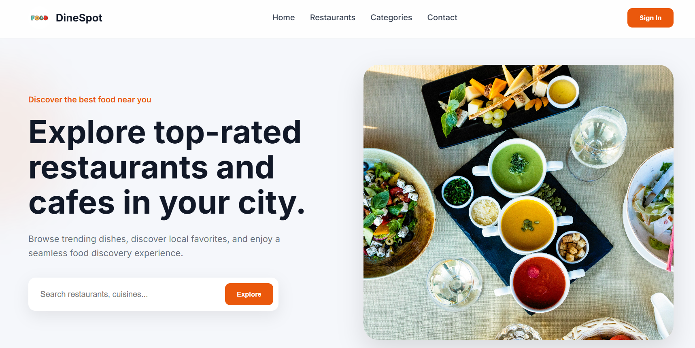
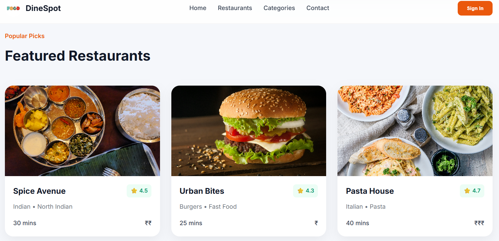

# 🍽️ DineSpot – Restaurant Discovery Website

DineSpot is a modern and responsive restaurant discovery landing page built using HTML, CSS, and JavaScript.

The project focuses on clean UI/UX, responsive layouts, restaurant showcase sections, category browsing, and interactive search functionality.

---

## 🚀 Features

- Responsive modern UI
- Interactive restaurant search filtering
- Restaurant cards with ratings and categories
- Mobile-first responsive design
- Category browsing section
- Contact section
- Smooth and clean user experience

---

## 🛠️ Tech Stack

- HTML5
- CSS3
- JavaScript (DOM Manipulation)

---

## 💡 JavaScript Features

- Dynamic restaurant search filtering
- Real-time DOM updates using event listeners

---

## 📱 Responsive Design

Fully responsive across:
- Desktop
- Tablet
- Mobile Devices

---

## 📸 Screenshots

### Desktop View

### Mobile View

### Restaurant Section

---

## 🔗 Live Demo

(Add Netlify link here after deployment)

---

## 👩‍💻 Author

Tichita